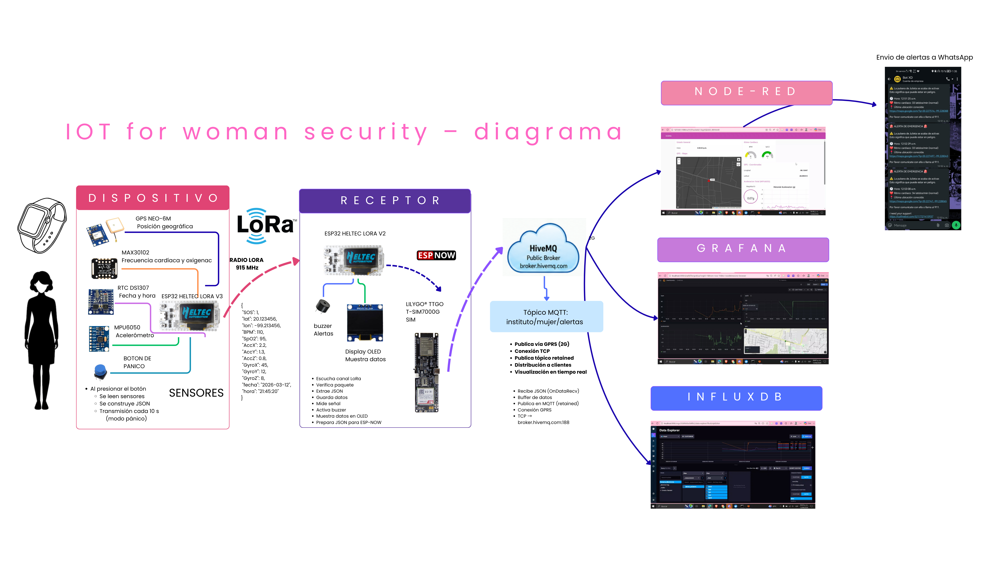

# IoT Implementation for Women's Safety
## Implementación del IoT para la Seguridad de las Mujeres

**Tema 1: Estándares de Comunicación Inalámbrica**


**Repositorio GitHub:** [github.com/Karenperezor/Codigo-Integrador6](https://github.com/Karenperezor/Codigo-Integrador6)  
**Estado:** Repositorio Público - Acceso abierto para replicación del proyecto

---

## Estudiantes

| Estudiante |
|-------------|
| **Melanie Santiago Resendiz** (230110616) |
| **Karen Perez Ortiz** (230110326) |
| **Carol Mera Ibarra** (230110264) |
| **Andrea Jacob Salas** (230110449) |
| **Freyra Wendy Martinez Martinez** (230110434) |

**Institución**: Instituto Tecnológico Superior del Occidente del Estado de Hidalgo  
**Grado y Grupo**: 6 "B"  
**Materia**: Tecnologías Inalámbricas - Tema 1: Estándares de Comunicación Inalámbrica
--- 

 
## Tabla de Contenidos

- [Introducción](#introducción)
  - [Contexto del Problema](#contexto-del-problema)
  - [Arquitectura de Comunicación Inalámbrica](#arquitectura-de-comunicación-inalámbrica)
  - [Característica Diferenciadora: Privacidad Centrada en el Consentimiento](#característica-diferenciadora-privacidad-centrada-en-el-consentimiento)
- [Justificación](#justificación)
- [Objetivos](#objetivos)
  - [Objetivo General](#objetivo-general)
  - [Objetivos Específicos](#objetivos-específicos)
- [Requerimientos de Software y Hardware](#requerimientos-de-software-y-hardware)
  - [Hardware](#hardware)
  - [Software](#software)
- [Tabla de Conexiones](#tabla-de-conexiones)
  - [Nodo Emisor (Heltec ESP32 LoRa v3)](#nodo-emisor-heltec-esp32-lora-v3)
  - [Nodo Receptor (Heltec ESP32 LoRa v3)](#nodo-receptor-heltec-esp32-lora-v3)
  - [Gateway LilyGO T-SIM7000 (GPRS)](#gateway-lilygo-t-sim7000-gprs)
  - [Topología de Red](#topología-de-red)
- [Tabla de Direccionamiento](#tabla-de-direccionamiento)
- [Esquema de Funcionamiento](#esquema-de-funcionamiento)
  - [Flujo de Datos Completo](#flujo-de-datos-completo)
  - [Pantallas del Receptor](#pantallas-del-receptor)
  - [Diagrama de Capas OSI](#diagrama-de-capas-osi)
  - [Lógica de Alertas en Node-RED](#lógica-de-alertas-en-node-red)
- [Códigos Comentados del Proyecto](#códigos-comentados-del-proyecto)
  - [Nodo Emisor - Version1-TRANSMISOR.ino](#nodo-emisor---version1-transmisorino)
  - [Nodo Receptor - receptor_Hv2.ino](#nodo-receptor---receptor_hv2ino)
  - [Gateway Celular - lilygo.ino](#gateway-celular---lilygoino)
- [Explicación de Configuraciones de Sensores y Tarjetas](#explicación-de-configuraciones-de-sensores-y-tarjetas)
  - [MAX30102 (Sensor Biométrico)](#max30102-sensor-biométrico)
  - [MPU6050 (Acelerómetro de 6 ejes)](#mpu6050-acelerómetro-de-6-ejes)
  - [NEO-6M (Módulo GPS)](#neo-6m-módulo-gps)

---
## Introducción

Este proyecto implementa un **sistema IoT funcional basado en tecnologías inalámbricas de largo alcance y bajo consumo** para el monitoreo en tiempo real de signos vitales y geolocalización de mujeres en situación de vulnerabilidad. El prototipo opera mediante la integración de nodos sensores y gateways que transmiten datos biométricos desde una pulsera emisora inteligente hacia un servidor central de procesamiento y visualización.

[ Volver al índice](#tabla-de-contenidos)

### Plantemiento del Problema

El proyecto aborda directamente la problemática de la **violencia de género en el municipio de Tlahuelilpan, Hidalgo**, donde el **70.1% de las mujeres de 15 años o más han experimentado al menos un incidente de violencia** según datos del INEGI. Esta solución se alinea con el **eje de Seguridad Humana de los PRONACES** (Programas Nacionales Estratégicos).

### Arquitectura de Comunicación Inalámbrica

El sistema integra dos categorías de tecnologías inalámbricas:

- **LoRa (LPWAN)**: Comunicación de corto a medio alcance entre la pulsera emisora y el gateway receptor
- **GPRS (WWAN)**: Transmisión de datos hacia el servidor en la nube desde el gateway

Esta combinación garantiza **cobertura robusta en escenarios donde el Wi-Fi es limitado** y proporciona **conectividad sin interrupciones durante emergencias**.

### Característica Diferenciadora: Privacidad Centrada en el Consentimiento

A diferencia de otras soluciones de monitoreo continuo, este prototipo incorpora un **mecanismo de privacidad que activa la transmisión de datos únicamente durante una hora a partir del momento en que la usuaria presiona el botón de pánico**. Esto evita el rastreo permanente de su ubicación, diferenciando al prototipo de sistemas basados en WLAN o satelitales.

---

## Justificación

### Por qué este proyecto es necesario

1. **Violencia de Género**: La violencia contra las mujeres es un problema crítico en México que requiere soluciones tecnológicas accesibles y confiables.

2. **Tecnología Apropiada**: Las tecnologías inalámbricas como LoRa y GPRS permiten:
   - Monitoreo en tiempo real sin dependencia de Wi-Fi
   - Operación en zonas con cobertura celular limitada
   - Bajo consumo energético para dispositivos portátiles

3. **Beneficiario Directo**: El **Instituto de la Mujer de Tlahuelilpan** requiere herramientas de vanguardia para la protección y seguimiento de sus usuarias con precisión sin precedentes.

4. **Aplicación Educativa**: Este desarrollo fortalece la comprensión práctica de los estándares de comunicación inalámbrica (Tema 1, 2 y 3) mediante un caso de uso real y socialmente relevante.

5. **Escalabilidad**: El diseño modular permite escalar la solución a otras instituciones y municipios con problemáticas similares.

[ Volver al índice](#tabla-de-contenidos)

---

## Objetivos

### Objetivo General

Diseñar y construir un **prototipo IoT funcional basado en Heltec ESP32 LoRa v3** que monitoree en tiempo real:
- Ritmo cardíaco (BPM)
- Oxigenación en sangre (SpO2)
- Aceleración en tres ejes (X, Y, Z)
- Ubicación GPS de la usuaria

Transmitiendo los datos vía **LoRa y GPRS** al Instituto de la Mujer durante una **ventana de una hora activada por una sola pulsación del botón de pánico**, aplicando los estándares de comunicación inalámbrica para garantizar **calidad, confiabilidad y seguridad** de los datos.

### Objetivos Específicos

1. **Implementar la lectura simultánea** de SpO2, BPM y aceleración (ejes X, Y, Z) en la pulsera emisora LoRa, incluyendo activación por doble pulsación del botón de pánico.

2. **Configurar la comunicación LoRa** entre la pulsera emisora y el gateway LilyGO T-SIM, verificando la integridad de la trama en el display de cada módulo.

3. **Establecer el enlace GPRS** con el broker público HiveMQ mediante el APN de Telcel, publicando paquetes JSON con todos los parámetros del sensor.

4. **Desarrollar un dashboard en Node-RED** con mapa GPS en tiempo real, medidores de BPM y SpO2, historial de aceleración y lógica de alertas automáticas.

5. **Estructurar una base de datos en InfluxDB** vinculada a Grafana para el registro histórico de signos vitales, aceleración y geolocalización.

[ Volver al índice](#tabla-de-contenidos)
---

## Requerimientos de Software y Hardware

### Hardware

#### Nodo Emisor (Pulsera Inteligente)


| Componente | Modelo | Función |
|-----------|--------|---------|
| **Microcontrolador Principal** | Heltec ESP32 LoRa v3 | Procesamiento central, radio LoRa integrado (SX1262) |
| **Sensor Biométrico** | MAX30102 | Medición de ritmo cardíaco (BPM) y oxigenación (SpO2) |
| **Acelerómetro** | MPU6050 | Detección de movimiento y caídas (ejes X, Y, Z) |
| **Módulo GPS** | NEO-6M | Geolocalización en tiempo real |
| **Reloj en Tiempo Real** | DS1307 | Marca de tiempo independiente de GPS |
| **Batería** | LiPo 3.7V (2000 mAh) | Alimentación del nodo emisor |
| **Carcasa** | Impresión 3D personalizada | Protección de componentes |


#### Nodo Receptor y Gateway


| Componente | Modelo | Función |
|-----------|--------|---------|
| **Receptor LoRa** | Heltec ESP32 LoRa v3 | Recepción de tramas LoRa |
| **Gateway de Datos** | LilyGO T-SIM7000 | Módulo GPRS para conexión celular |
| **Red Celular** | Telcel (2G/3G) | Conectividad WWAN |

#### Servidor Local

| Componente | Especificación | Función |
|-----------|--------|---------|
| **Computadora** | x86 / ARM | Alojamiento de servicios |
| **SO** | Linux / Windows / macOS | Sistema operativo |


### Software

#### En el Nodo Emisor (Arduino IDE con ESP32 Heltec)
```
- RadioLib.h (SX1262 en Heltec)
- HT_SSD1306Wire (Display OLED)
- HT_TinyGPS++ (Mdulo GPS NEO-6M)
- RTClib (RTC DS3231)
- MPU6050 (Acelermetro)
- MAX30105 (Sensor biomtrico)
- heartRate (Algoritmo de deteccin de pulsaciones)
- HardwareSerial (UART para GPS)
- Lenguaje: C++ (Arduino Sketch)
```

#### En el Nodo Receptor (Arduino IDE con ESP32)
```
- RadioLib.h (SX1276 en Heltec)
- Adafruit_SSD1306 (Display OLED)
- Adafruit_GFX (Librera grfica)
- esp_now.h (Comunicación RF)
- WiFi.h (Inicializar ESP-NOW)
- Lenguaje: C++ (Arduino Sketch)
```

#### En el Gateway (Arduino IDE con LilyGO T-SIM7000)
```
- TinyGsmClient.h (Mdulo GPRS SIM7000)
- PubSubClient.h (Cliente MQTT)
- WiFi.h (WiFi + ESP-NOW)
- esp_now.h (Recibir datos RF)
- HardwareSerial (UART para mdem)
- Lenguaje: C++ (Arduino Sketch)
```

#### En el Servidor Local
```
- Node-RED v3.0.0+ (Flujos de procesamiento)
- InfluxDB v2.0+ (Base de datos de series de tiempo)
- Grafana v9.0+ (Visualizacin de datos)
- Broker MQTT: HiveMQ (pblico)
- Docker (opcional, para contenedores)
```

#### Herramientas de Desarrollo
```
- Arduino IDE 2.0+
- Git & GitHub (versionamiento)
- Visual Studio Code (edicin de código)
- Postman (pruebas de API)
```

[ Volver al índice](#tabla-de-contenidos)

---

##  Tabla de Conexiones

### Conexiones Elctricas - Nodo Emisor (Heltec ESP32 LoRa v3)

#### Sensor MAX30102 (I2C)
| Pin MAX30102 | Pin Heltec ESP32 | Descripcin |
|------------|-----------------|-------------|
| SDA | GPIO 21 | Lnea de datos I2C |
| SCL | GPIO 22 | Lnea de reloj I2C |
| VCC | 3.3V | Alimentación positiva |
| GND | GND | Referencia comn |

#### Acelermetro MPU6050 (I2C)
| Pin MPU6050 | Pin Heltec ESP32 | Descripcin |
|------------|-----------------|-------------|
| SDA | GPIO 21 | Lnea de datos I2C (compartida con MAX30102) |
| SCL | GPIO 22 | Lnea de reloj I2C (compartida con MAX30102) |
| VCC | 3.3V | Alimentación positiva |
| GND | GND | Referencia comn |
| INT | GPIO 15 | Interrupcin de deteccin de movimiento |

#### Mdulo GPS NEO-6M (UART)
| Pin NEO-6M | Pin Heltec ESP32 | Descripcin |
|-----------|-----------------|-------------|
| TX | GPIO 16 (RX) | Transmisin de datos GPS |
| RX | GPIO 17 (TX) | Recepcin de comandos |
| VCC | 3.3V | Alimentación positiva |
| GND | GND | Referencia comn |

#### Reloj DS1307 (I2C)
| Pin DS1307 | Pin Heltec ESP32 | Descripcin |
|-----------|-----------------|-------------|
| SDA | GPIO 21 | Lnea de datos I2C |
| SCL | GPIO 22 | Lnea de reloj I2C |
| VCC | 3.3V | Alimentación positiva |
| GND | GND | Referencia comn |
| BAT | Batera CR2032 | Batera de respaldo interna |

#### Botn de Pnico
| Pin Botn | Pin Heltec ESP32 | Descripcin |
|----------|-----------------|-------------|
| Entrada | GPIO 0 | Entrada digital (con pull-up) |
| GND | GND | Referencia comn |

#### Batera LiPo
| Conexin | Puerto Heltec ESP32 | Descripcin |
|---------|-----------------|-------------|
| +4.2V | Puerto USB-C (integrado) | Carga y alimentacin |
| GND | GND | Referencia comn |

---

### Conexiones Eléctricas - Nodo Receptor (Heltec ESP32 LoRa v2)

### Display OLED SSD1306 (I2C)

| Pin OLED | Pin Heltec ESP32 | Descripción |
|-----------|-----------------|-------------|
| SDA | GPIO 4 | Línea de datos I2C |
| SCL | GPIO 15 | Línea de reloj I2C |
| RST | GPIO 16 | Reset del display |
| VCC | 3.3V | Alimentación positiva |
| GND | GND | Referencia común |
| Dirección I2C | 0x3C | Dirección del dispositivo |

#### Buzzer Activo

| Pin Buzzer | Pin Heltec ESP32 | Descripción |
|-----------|-----------------|-------------|
| Señal (+) | GPIO 13 | Control de buzzer (activo en alto) |
| GND (-) | GND | Referencia común |

#### Batería LiPo

| Conexión | Puerto Heltec ESP32 | Descripción |
|---------|---------------------|-------------|
| +3.2V | Puerto USB-C (integrado) | Carga y alimentación |
| GND | GND | Referencia común |


> **Nota**: El nodo receptor **no** incluye sensores biométricos (MAX30102, MPU6050, GPS NEO-6M ni DS1307).
> Su función es exclusivamente recibir tramas LoRa de la pulsera, mostrarlas en el display OLED
> y reenviarlas por ESP-NOW al gateway celular (MAC destino: `80:64:6F:FC:0A:50`).

---

### Conexiones Eléctricas - Gateway LilyGO T-SIM7000 (GPRS)

| Componente | Conexión |
|-----------|---------|
| Nodo Receptor Heltec | UART Serial |
| Antena SIM | Ranura SIM integrada |
| Antena GPRS | Conectada en placa |
| Computadora (servidor) | USB Serial |

---

### Topologia de Red

### Topología de Red



La topología presentada muestra la arquitectura completa del sistema IoT desarrollado para la seguridad de las mujeres, utilizando tecnologías inalámbricas de largo alcance y servicios de monitoreo en tiempo real.

El sistema está dividido en diferentes capas de comunicación y procesamiento, permitiendo la adquisición, transmisión, almacenamiento y visualización de datos biométricos y de ubicación.

#### 1. Nodo Emisor - Pulsera Inteligente

La primera parte de la topología corresponde al **dispositivo portátil IoT**, diseñado como una pulsera inteligente basada en un **Heltec ESP32 LoRa V3**. Este nodo integra diversos sensores encargados de recopilar información crítica de la usuaria:

- **GPS NEO-6M**: Obtiene la ubicación geográfica en tiempo real.
- **MAX30102**: Mide la frecuencia cardíaca y el nivel de oxigenación en sangre (SpO2).
- **RTC DS1307**: Genera marcas de tiempo para registrar fecha y hora.
- **MPU6050**: Detecta movimiento, aceleración y posibles caídas.
- **Botón de pánico**: Activa el envío de alertas de emergencia.

Cuando la usuaria presiona el botón de pánico, el sistema inicia la lectura de sensores y transmite la información cada cierto intervalo de tiempo mediante tecnología **LoRa a 915 MHz**.

---

#### 2. Comunicación LoRa

La comunicación entre el nodo emisor y el receptor se realiza utilizando el protocolo **LoRa (Long Range)**, el cual permite:

- Comunicación inalámbrica de largo alcance.
- Bajo consumo energético.
- Funcionamiento en zonas con acceso limitado a Wi-Fi.
- Alta confiabilidad para el envío de alertas críticas.

Los paquetes transmitidos contienen datos como:

- Estado SOS.
- Coordenadas GPS.
- BPM.
- SpO2.
- Valores del acelerómetro.
- Fecha y hora.

---

#### 3. Nodo Receptor

El nodo receptor está compuesto por otro **Heltec ESP32 LoRa**, encargado de recibir las tramas enviadas por la pulsera inteligente.

Este módulo realiza varias funciones:

- Escuchar constantemente el canal LoRa.
- Verificar la integridad de los paquetes.
- Activar alertas mediante buzzer.
- Mostrar información en una pantalla OLED.
- Preparar los datos para su envío hacia internet.

Además, el receptor se comunica con un **LilyGO TTGO T-SIM7000G**, el cual proporciona conectividad celular mediante tecnología **GPRS**.

---

#### 4. Gateway GPRS y Broker MQTT

El módulo **LilyGO T-SIM7000G** funciona como gateway de comunicaciones, permitiendo enviar los datos hacia la nube utilizando la red celular de Telcel.

La transmisión se realiza mediante el protocolo **MQTT**, publicando la información en el broker público **HiveMQ** bajo el tópico:

```text
instituto/mujer/alertas
```

MQTT fue seleccionado debido a que es un protocolo ligero, eficiente y ampliamente utilizado en aplicaciones IoT.

---

#### 5. Plataforma de Monitoreo y Visualización

Una vez que los datos llegan al broker MQTT, diferentes plataformas consumen la información en tiempo real:

##### Node-RED
Se utiliza para:

- Procesamiento de mensajes MQTT.
- Automatización de alertas.
- Visualización de datos en dashboards.
- Envío de notificaciones de emergencia.

##### Grafana
Permite:

- Crear paneles de monitoreo.
- Visualizar gráficas históricas.
- Analizar comportamiento de signos vitales.
- Supervisar datos de sensores en tiempo real.

##### InfluxDB
Funciona como base de datos temporal e histórica para:

- Almacenar signos vitales.
- Guardar registros GPS.
- Registrar eventos de emergencia.
- Mantener historiales de aceleración y actividad.

---

#### 6. Sistema de Alertas

Finalmente, el sistema genera alertas automáticas mediante WhatsApp cuando:

- Se activa el botón de pánico.
- Se detectan anomalías en signos vitales.
- Existen cambios bruscos de movimiento o posibles caídas.

Esto permite que el Instituto de la Mujer pueda reaccionar rápidamente ante situaciones de riesgo.

---

### Flujo General de la Comunicación

```text
Pulsera Inteligente → LoRa → Nodo Receptor → GPRS/MQTT → HiveMQ → Node-RED / Grafana / InfluxDB → Alertas
```

[ Volver al índice](#tabla-de-contenidos)


---


##  Tabla de Direccionamiento

### Configuración de Redes Inalámbricas

#### Red LoRa (WPAN - Personal Area Network)
| Parmetro | Valor | Descripcin |
|-----------|-------|-------------|
| **Estndar** | LoRaWAN / LoRa punto a punto | Protocolo inalmbrico LPWAN |
| **Frecuencia** | 868 MHz (Europa) / 915 MHz (Amrica) | Banda ISM no licenciada |
| **Ancho de Banda** | 125 kHz - 500 kHz | Configurable en firmware |
| **Factor de Expansin (SF)** | 7-12 | SF=7: corto alcance, SF=12: largo alcance |
| **Potencia TX** | +20 dBm mximo | Regulado por regulaciones locales |
| **Rango** | 5-15 km (línea visual) | Depende del SF y altura |
| **Topologa** | Punto a punto (gateway de puerta de enlace) | Nodo emisor  Nodo receptor |
| **Identificadores** | No requiere direccin MAC nica | Comunicación directa en topologa local |

#### Red GPRS (WWAN - Wide Area Network)
| Parmetro | Valor | Descripcin |
|-----------|-------|-------------|
| **Estndar** | GSM/GPRS (2G) y UMTS (3G) | Redes celulares pblicas |
| **Proveedor** | Telcel Mxico | Operador de telecomunicaciones |
| **APN** | internet.telcel.com | Access Point Name para datos |
| **Protocolo** | TCP/IP sobre GPRS | Comunicación de datos en red celular |
| **Velocidad** | 115200 bps (UART serial) | Configuración del mdulo LilyGO |
| **Cobertura** | Nacional (Telcel) | Disponibilidad en Mxico |

#### Red MQTT (Broker HiveMQ)
| Parmetro | Valor | Descripcin |
|-----------|-------|-------------|
| **Servidor** | broker.hivemq.com | Broker MQTT pblico |
| **Puerto** | 1883 | Puerto estndar MQTT (sin TLS) |
| **Protocolo** | MQTT v3.1.1 | Protocolo de publicacin/suscripcin |
| **Tpico de Publicacin** | instituto/mujer/alertas | Nombre del canal de comunicacin |
| **QoS** | 0 | Quality of Service (sin garanta de entrega) |
| **Payload** | JSON | Formato de datos transmitido |

#### Base de Datos InfluxDB (Servidor Local)
| Parmetro | Valor | Descripcin |
|-----------|-------|-------------|
| **Ubicacin** | Localhost (127.0.0.1) | Servidor local |
| **Puerto** | 8086 | Puerto por defecto InfluxDB |
| **Base de Datos** | iot_women_safety | Nombre de la base de datos |
| **Medicin (Tabla)** | sensor_data | Nombre de la serie de tiempo |
| **Campos (Columnas)** | BPM, SpO2, AccX, AccY, AccZ, Latitud, Longitud | Parmetros almacenados |
| **Tags (índices)** | user_id, device_id, timestamp | Claves de bsqueda |

#### Node-RED (Servidor Local)
| Parmetro | Valor | Descripcin |
|-----------|-------|-------------|
| **Ubicacin** | Localhost (127.0.0.1) | Servidor local |
| **Puerto HTTP** | 1880 | Interfaz de edicin de flujos |
| **Suscripcin MQTT** | instituto/mujer/alertas | Tpico de entrada |
| **Nodos principales** | MQTT-in, Function, Switch, Dashboard | Componentes activos |

#### Grafana (Servidor Local)
| Parmetro | Valor | Descripcin |
|-----------|-------|-------------|
| **Ubicacin** | Localhost (127.0.0.1) | Servidor local |
| **Puerto HTTP** | 3000 | Interfaz de visualización |
| **Datasource** | InfluxDB (127.0.0.1:8086) | Fuente de datos |
| **Autenticacin** | admin:admin (por defecto) | Credenciales iniciales |

---

##  Esquema de Funcionamiento

### Flujo de Datos Completo

```
1. PULSERA (Heltec ESP32 LoRa v3 + Sensores)
    Captura signos vitales (BPM, SpO2)
    Captura aceleracin (X, Y, Z)
    Captura GPS + Timestamp RTC
    Transmite por LoRa cada 2 segundos en pnico
   
    LoRa 915 MHz (alcance 5-15km)
   
2. RECEPTOR (Heltec ESP32 LoRa v3)
    Recibe trama LoRa
    Valida integridad
    Muestra en 6 pantallas OLED
      Pant 1: ESPERA (con arcos de seal)
      Pant 2: DATOS/ALERTA (inversin si pnico)
      Pant 3: DETALLES GPS
      Pant 4: ESTADSTICAS
      Pant 5: HISTORIAL
      Pant 6: SEAL PERDIDA (con timeout)
    Activa buzzer inteligente (solo pnico)
    Reenva por ESP-NOW al Gateway
   
    ESP-NOW 2.4 GHz (línea recta ~100m)
   
3. GATEWAY (LilyGO T-SIM7000)
    Recibe por ESP-NOW
    Abre conexin GPRS (Telcel)
    Publica en HiveMQ MQTT
    LED parpadea en confirmacin
   
    GPRS/CAT-M (cobertura nacional Telcel)
   
4. CLOUD (HiveMQ Broker)
    Almacena en tpico: instituto/mujer/alertas
    Disponible para Node-RED/Grafana
```

### Pantallas del Receptor (6 diferentes)

| # | Nombre | Contenido | Cuando |
|---|--------|----------|--------|
| 1 | **ESPERA** | Arcos de seal LoRa animados + barra scanning | Sin datos |
| 2 | **DATOS/ALERTA** | BPM y aceleracin en cards. Invierte si pnico | Datos normales o pnico |
| 3 | **DETALLES GPS** | Coordenadas grandes, badge FIX, satlites | Cualquier momento |
| 4 | **ESTADSTICAS** | 3 cards: RX/ERR/%OK + barra de xito | Cualquier momento |
| 5 | **HISTORIAL** | ltimos 5 paquetes con alternancia de fondo | Cualquier momento |
| 6 | **SEAL PERDIDA** | Antena rota, tiempo MM:SS, barra de timeout | >15 segundos sin RX |

### Diagrama de Capas OSI

```

 7. APLICACIN                                               
     Grafana (visualización), API REST de Node-RED        

 6. PRESENTACIN                                             
     Formato JSON, grficas en tiempo real                

 5. SESIN                                                   
     MQTT (conexin a broker HiveMQ)                      

 4. TRANSPORTE                                               
     TCP (MQTT sobre HiveMQ)                              
     UART Serial (Heltec  LilyGO)                        

 3. RED                                                      
     GPRS (LilyGO T-SIM) - WAN                           
     MQTT packet structure                                
     TCP/IP stack                                         

 2. ENLACE                                                   
     I2C (sensores internos al microcontrolador)         
     LoRa (modulation SX1262, Heltec emisor  receptor) 
     GSM frame (GPRS sobre Telcel)                       

 1. FSICA                                                   
     LoRa: 868 MHz, modulacin LORA, 5-15 km rango     
     GPRS: 2G/3G Telcel, antena celular                 
     I2C: 3.3V, 100-400 kHz                              
     UART: 115200 bps, RS232-like levels               
     GPIO: lgica 3.3V                                   

```

### Lgica de Alertas en Node-RED

```javascript
// Pseudo-código de la lgica implementada en Node-RED

if (SpO2 < 90) {
    alert_type = "CRTICA";
    alert_reason = "Oxigenacin baja";
    severity = "HIGH";
    action = "Notificar Instituto inmediatamente";
}

if (BPM < 50 || BPM > 120) {
    alert_type = "ADVERTENCIA";
    alert_reason = "Ritmo cardaco anmalo";
    severity = "MEDIUM";
}

if (aceleracion_magnitude > 2g) {
    alert_type = "CADA DETECTADA";
    alert_reason = "Cambio abrupto de aceleracin";
    severity = "HIGH";
    action = "Solicitar confirmacin de usuaria o asistencia";
}

// Enviar a Grafana con timestamp
update_dashboard(BPM, SpO2, acceleration, GPS_location, alert_type);
```

[ Volver al índice](#tabla-de-contenidos)

---

##  Códigos Comentados del Proyecto

### 1. Código del Nodo Emisor - PULSERA (Heltec ESP32 LoRa v3)

**Caractersticas principales:**
-  Detecta automticamente emergencias (cadas > 3.5g, forcejeo > 2.0g)
-  Monitoreo de signos vitales (BPM, SpO2) con MAX30102
-  Geolocalizacin GPS con marca de tiempo RTC
-  Transmisin LoRa cada 2 segundos durante pnico
-  Pantalla OLED con interfaz visual mejorada
-  Gestin inteligente de mltiples buses I2C

[Nodo Emisor - Version1-TRANSMISOR.ino](https://github.com/Karenperezor/Codigo-Integrador6/blob/main/Version1-TRANSMISOR.ino)

### 2. Código del Nodo Receptor LoRa (Heltec ESP32 LoRa v3)

**Caractersticas principales:**
-  Recibe datos LoRa de la pulsera
-  Reenva por ESP-NOW al Gateway celular
-  6 pantallas OLED con interfaz mejorada
-  Deteccin automtica de prdida de seal
-  Buzzer inteligente (solo en pnico)
-  LED indicador de actividad

[Nodo Receptor - receptor_Hv2.ino](https://github.com/Karenperezor/Codigo-Integrador6/blob/main/receptor_Hv2.ino)

### 3. Código del Gateway GPRS (LilyGO T-SIM7000 + ESP-NOW)

Archivo: Version1-TRANSMISOR.ino

**Caractersticas principales:**
-  Recibe datos por **ESP-NOW** del receptor LoRa
-  Conecta a red celular Telcel (GPRS/CAT-M)
-  Publica a HiveMQ MQTT sin intermediarios
-  Reconexin automtica GPRS y MQTT
-  LED de confirmacin visual

[Gateway Celular - lilygo.ino](https://github.com/Karenperezor/Codigo-Integrador6/blob/main/lilygo.ino)


[ Volver al índice](#tabla-de-contenidos)

---

##  Explicacin de Configuraciones de Sensores y Tarjetas

### MAX30102 (Sensor Biomtrico)

**Funcin**: Mide ritmo cardaco (BPM) y saturacin de oxgeno (SpO2)

**Especificaciones**:
- Protocolo: I2C (direccin: 0x57)
- Voltaje: 1.8V - 5.5V (se usa 3.3V)
- Corriente: 11mA tpico
- Precisin BPM: 5 bpm
- Precisin SpO2: 2%
- Rango de luz: Rojo (660nm) e Infrarrojo (880nm)

**Configuración en código**:
```cpp
particleSensor.setup(
    25,    // LED brightness (0-255)
    2,     // Sample averaging
    100,   // Mode: 0=HR, 1=SpO2, 2=Multi-LED (HR+SpO2)
    25,    // Sample rate
    500,   // Pulse width (us)
    100    // ADC resolution (bits)
);
```

**Puntos crticos**:
- Requiere contacto directo de la piel
- Sensible a luz ambiental (proteger con carcasa oscura)
- Necesita calibracin inicial con lecturas conocidas
- Tiempo de estabilizacin: 10-20 segundos

---

### MPU6050 (Acelermetro de 6 ejes)

**Funcin**: Mide aceleracin en 3 ejes (X, Y, Z) y rotacin angular

**Especificaciones**:
- Protocolo: I2C (direccin: 0x68 o 0x69)
- Voltaje: 3.3V - 5V (se usa 3.3V)
- Corriente: 3.9mA tpico
- Rango aceleracin: 2g, 4g, 8g, 16g (configurable)
- Rango giroscopio: 250/s a 2000/s
- Resolución: 16 bits

**Configuración en código**:
```cpp
mpu.initialize();
mpu.setFullScaleAccelRange(MPU6050_ACCEL_FS_16);  // 16g
mpu.setFullScaleGyroRange(MPU6050_GYRO_FS_2000);  // 2000/s
mpu.setDLPFMode(MPU6050_DLPF_BW_184);             // Filtro 184Hz
```

**Deteccin de Cadas**:
```cpp
float magnitude = sqrt(ax*ax + ay*ay + az*az);
if (magnitude > 2.0g) {
    // CADA DETECTADA
}
```

**Calibracin**:
- Colocar sobre superficie plana
- Ejecutar setAccelOffsets() con tablero horizontal
- Acelmetro debe leer (0, 0, 1g) en reposo

---

### NEO-6M (Mdulo GPS)

**Funcin**: Proporciona geolocalización con coordenadas GPS

**Especificaciones**:
- Protocolo: UART serial (9600 bps por defecto)
- Voltaje: 3.3V - 5V (se usa 3.3V)
- Corriente: 45mA tpico
- Precisin: 2.5 metros (tpico)
- Tiempo de adquisicin:
  - Hot start: ~1 segundo
  - Cold start: ~30 segundos
- Frecuencia de actualización: 1-10 Hz

**Configuración en código**:
```cpp
Serial2.begin(9600, SERIAL_8N1, GPS_RX, GPS_TX);
TinyGPSPlus gps;

void loop() {
    while (Serial2.available() > 0) {
        gps.encode(Serial2.read());
    }
    
    if (gps.location.isValid()) {
        latitude = gps.location.lat();
        longitude = gps.location.lng();
    }
}
```

**Informacin NMEA disponible**:
- GGA: Posicin global (lat, lon, altitud)
- GSA: Dilucin de precisin
- GSV: Satlites visibles
- RMC: Datos mnimos + velocidad

**Mejoras de precisin**:
- Aguardar a que tenga mnimo 4 satlites (en gps.satellites.isValid())
- Usar DGPS si hay base cercana (no implementado en este proyecto)
- Promediar 5-10 lecturas para ubicacin crtica

---

### DS1307 (Reloj en Tiempo Real)

**Funcin**: Proporciona timestamp independiente, incluso sin seal GPS

**Especificaciones**:
- Protocolo: I2C (direccin: 0x68)
- Voltaje: 4.5V - 5.5V (se usa 3.3V con resistencias pull-up)
- Batera: CR2032 (3V, interna)
- Precisin: 2 minutos por mes tpico
- Corriente: 500A con batera

**Configuración en código**:
```cpp
#include <RTClib.h>

RTC_DS1307 rtc;

void setup() {
    if (!rtc.begin()) {
        Serial.println("RTC no encontrado");
    }
    if (!rtc.isrunning()) {
        // Ajustar a hora actual del compilador
        rtc.adjust(DateTime(F(__DATE__), F(__TIME__)));
    }
}

void read_timestamp() {
    DateTime now = rtc.now();
    sprintf(timestamp, "%04d-%02d-%02d %02d:%02d:%02d",
            now.year(), now.month(), now.day(),
            now.hour(), now.minute(), now.second());
}
```

**Ventajas sobre GPS para timestamp**:
- No requiere adquisicin satlital
- Ms rpido
- Permite timestamping incluso en zonas sin cobertura GPS

**Limitacin**: Requiere sincronizacin inicial y ajuste peridico

---

### Heltec ESP32 LoRa v3 (Microcontrolador)

**Funcin**: Procesamiento central, radio LoRa integrado, pantalla OLED

**Especificaciones**:
- Procesador: Dual-core Xtensa 32-bit @ 240MHz
- RAM: 520 KB SRAM
- Flash: 4 MB
- Radio LoRa: SX1262 (integrado)
- Pantalla: OLED 12864 pixels
- Puerto USB: Serial para programacin
- Pines GPIO: 36 (multipropsito)
- ADC: 12-bit, 18 canales
- I2C: 2 buses disponibles
- UART: 3 puertos seriales
- SPI: Disponible para expansin

**Configuración de Pines LoRa (Heltec)**:
```
NSS  -> GPIO 8
MOSI -> GPIO 10
MISO -> GPIO 9
SCK  -> GPIO 11
RST  -> GPIO 12
DIO0 -> GPIO 13
```

**Ventajas**:
- Radio LoRa nativo (no requiere expansin)
- Display integrado para debugging
- Batera USB integrada
- Diseo de bajo consumo

---

### LilyGO T-SIM7000 (Gateway GPRS)

**Funcin**: Mdulo GPRS para transmisin de datos a travs de red celular

**Especificaciones**:
- Mdulo celular: SIM7000
- Bandas soportadas: 2G/3G GSM/GPRS/UMTS
- Voltaje: 3.7V - 4.2V (batera integrada)
- Corriente: 50mA en transmisin
- Antena: Integrada PCB
- Puertos:
  - Ranura SIM para tarjeta nano-SIM
  - UART para comunicacin con MCU
  - USB para programacin/depuracin

**Configuración APN para Telcel (Mxico)**:
```
APN: internet.telcel.com
Usuario: telcel
Contrasea: telcel
Protocolo: GPRS
Velocidad UART: 115200 bps
```

**Secuencia de conexin**:
1. Inicializar puerto serial (115200 bps)
2. Enviar comando AT
3. Configurar APN: AT+SAPBR=3,1,"APN","internet.telcel.com"
4. Activar conexin GPRS: AT+SAPBR=1,1
5. Conectar a servidor TCP: AT+HTTPPARA="URL","mqtt://servidor:puerto"

**Comandos AT tiles**:
```
AT                          // Prueba de comunicacin
AT+CSQ                      // Verificar nivel de seal
AT+COPS?                    // Operador actual
AT+CREG?                    // Estado de registro en red
AT+CGNSINF                  // Informacin GPS (si est disponible)
```

---

##  Explicacin de Alimentación Mvil y Fija

### Alimentación Mvil (Batera LiPo)

**Batera utilizada**: LiPo 4.2V (3000-5000 mAh)

**Caractersticas**:
- **Voltaje nominal**: 3.7V (cargada: 4.2V)
- **Capacidad**: 3000-5000 mAh tpico
- **Qumica**: Polmero de Litio
- **Ciclos de carga**: 300-500 tpicos
- **Peso**: ~50g
- **Tamao**: 50308 mm aprox.
- **Connector**: JST-PH 2.0mm (estndar)

**Consumo estimado del sistema**:

| Componente | Estado | Corriente |
|-----------|--------|-----------|
| Heltec ESP32 (CPU) | Activo | 80 mA |
| Heltec ESP32 (Sleep) | Reposo | 10 A |
| Radio LoRa TX | Transmisin | 100 mA |
| Radio LoRa RX | Recepcin | 40 mA |
| MAX30102 | Activo | 11 mA |
| MPU6050 | Activo | 3.9 mA |
| GPS NEO-6M | Activo | 45 mA |
| DS1307 | Activo | 0.5 mA |
| Display OLED | Activo | 15 mA |

**Consumo total en modo pnico**:
- Lectura sensores: ~60 mA
- Transmisin LoRa: ~100 mA
- Promedio durante ventana de 1 hora: ~70 mA

**Autonoma**:
- Capacidad: 4000 mAh
- Consumo: 70 mA
- **Autonoma: 4000  70 = ~57 horas en transmisin continua**
- **Autonoma en modo pnico (1 hora)**: Ms que suficiente

**Estrategias de ahorro de energa** (implementadas):
1. Modo sleep entre lecturas
2. Reducir frecuencia de lectura GPS (30 segundos)
3. Apagar sensores no crticos cuando no hay pnico
4. Display OLED solo en modo pnico

---

### Alimentación Fija (Servidor Local)

**Equipamiento**: Computadora, router, hub USB

**Requisitos**:
- **Alimentación**: 110V/220V AC según regin (Mxico: 110V)
- **Corriente tpica**: 200-500 mA (laptop) + 50mA (router)
- **Fuente recomendada**: 500W mnimo
- **UPS (opcional)**: Para proteger contra cadas de energa

**Consumo de servicios**:

| Servicio | Proceso | Memoria | CPU |
|---------|---------|---------|-----|
| Node-RED | node-red | 150-300 MB | 5-15% |
| InfluxDB | influxd | 100-200 MB | 10-20% |
| Grafana | grafana-server | 200-400 MB | 3-10% |
| Broker MQTT (local) | mosquitto | 20-50 MB | 1-5% |

**Total estimado**:
- Memoria: ~500-1000 MB
- CPU: ~25-50%
- **Computadora recomendada**: Mnimo Intel i3/AMD Ryzen 3, 4GB RAM, SSD 256GB

**Instalación recomendada** (Linux Ubuntu 20.04+):
```bash
# Docker (más eficiente)
docker run -d -p 1883:1883 eclipse-mosquitto
docker run -d -p 8086:8086 influxdb
docker run -d -p 3000:3000 grafana/grafana
docker run -d -p 1880:1880 nodered/node-red
```

---

## Recomendaciones de Mejora y Precauciones de Uso
 
### Mejoras Técnicas Identificadas
 
| Área | Limitación Actual | Propuesta de Solución | Impacto |
|-----|------------------|----------------------|---------|
| **Consumo Energético** | Batería dura ~10 horas (2000mAh) | Implementar deep sleep, GPS bajo demanda, BLE de respaldo | Extender a 24+ horas |
| **Tamaño del Dispositivo** | Pulsera muy grande (actual ~80x60mm) | Rediseñar PCB a 40x40mm, integrar componentes | Mejor discreción, aceptación usuario |
| **Redundancia** | Una sola ruta (LoRa+GPRS) | Agregar Bluetooth BLE como fallback | Funcionar sin cobertura celular |
| **Seguridad MQTT** | Broker público sin autenticación | Migrar a broker privado con TLS+tokens | Proteger privacidad de datos |
| **Monitoreo Remoto** | Solo local | Implementar VPN segura para acceso remoto | Operadores pueden monitorear desde cualquier lugar |
| **Precisión GPS** | 2.5 metros | Implementar correcciones DGPS/RTCM | Ubicación más precisa |
| **Gestión de Alertas** | Manual | Dashboard automático  | Respuesta más rápida |
 
### Historial de Mejoras Implementadas
 
| Versión | Cambio | Fecha | Efecto |
|---------|--------|-------|--------|
| v1.0 | Batería original 1000mAh | Marzo 2026 | Autonomía ~7 horas |
| v1.1 | Upgrade a batería 2000mAh | Mayo 2026 | Autonomía ~10 horas |
| v1.2 | Pantallas OLED mejoradas | Mayo 2026 | Mejor visualización, sin aumento de consumo |
 
### Precauciones de Uso
 
#### Para Usuarias
 
1. **Mantener batería cargada**
   - Cargar noche anterior a evento
   - Indicador visual cuando carga baja (<20%)
   - Tiempo de carga completa: 2 horas
   - Autonomía actual: 10 horas (batería 2000mAh)
   - En modo pánico: transmite durante 1 hora máximo

2. **Contacto de piel**
   - Sensor MAX30102 debe estar en contacto directo con la piel
   - Usar en muñeca, no sobre ropa
   - Limpiar zona antes de usar
   - Evitar movimientos excesivos durante lectura de signos vitales

3. **Privacidad**
   - Información solo se transmite cuando presiona pánico o se detecta emergencia
   - Botón de pánico NO es especialmente visible (discreción)
   - Datos históricos almacenados solo 30 días (configurable)
   - Transmisión se detiene automáticamente después de 1 hora

4. **Situaciones de emergencia**
   - Probar dispositivo regularmente (1x por semana)
   - Tener número de emergencia guardado en teléfono
   - Verificar cobertura celular Telcel en zona de operación
   - Tener contactos de confianza configurados en el Instituto

#### Para Operadores (Instituto de la Mujer)

1. **Capacitacin requerida**
   - Interpretacin de datos biométricos
   - Diferencias entre alertas (crtica vs. advertencia)
   - Protocolo de respuesta a cadas detectadas

2. **Mantenimiento de infraestructura**
   - Servidor debe estar activo 24/7
   - Copias de seguridad diarias de InfluxDB
   - Revisin de logs de errores (MQTT, Node-RED)

3. **Conformidad legal**
   - GDPR/LOPD: Datos personales almacenados < 30 das
   - Consentimiento de usuaria para transmisin
   - Registro de accesos a datos

4. **Escalabilidad**
   - Por cada 100 usuarias adicionales: +1GB RAM servidor
   - Considerar replicación de servicios (clustering)
   - Load-balancer si se usan mltiples gateways

#### Para Desarrolladores (Mantenimiento futuro)

1. **Actualizaciones de firmware**
   - Usar OTA (Over-The-Air) para ESP32
   - Probar en banco de pruebas antes de desplegar
   - Mantener respaldo de versin anterior

2. **Monitoreo de sensores**
   - MAX30102: Verificar calibracin c/ 1000 ciclos
   - MPU6050: Revisar offsets trimestralmente
   - GPS: Verificar almanaque de satlites

3. **Seguridad**
   - Cambiar contraseas por defecto de Grafana/InfluxDB
   - Implementar HTTPS en Node-RED
   - Auditar acceso a broker MQTT

4. **Anlisis de rendimiento**
   - Latencia MQTT: <3 segundos
   - Prdida de paquetes: <1%
   - Precisin GPS: <5 metros

---

##  Instalación y Configuración Rápida

### Instalación del Firmware en Heltec

```bash
# 1. Instalar Arduino IDE
# 2. Agregar board manager URL: https://raw.githubusercontent.com/Heltec-Aaron-Lee/WiFi_Kit_series/master/package_heltec_esp32_index.json
# 3. Instalar Heltec ESP32 board
# 4. Seleccionar "Heltec WiFi LoRa 32 (V3)"
# 5. Cargar código: Sketch  Upload
```

### Instalación del Servidor Local (Docker)

```bash
# Crear carpeta de trabajo
mkdir iot_women_safety && cd iot_women_safety

# Docker Compose
cat > docker-compose.yml << 'EOF'
version: '3'
services:
  influxdb:
    image: influxdb:2.0
    ports:
      - "8086:8086"
    environment:
      INFLUXDB_DB: iot_women_safety
    volumes:
      - ./data/influxdb:/var/lib/influxdb

  grafana:
    image: grafana/grafana:latest
    ports:
      - "3000:3000"
    depends_on:
      - influxdb
    volumes:
      - ./data/grafana:/var/lib/grafana

  nodered:
    image: nodered/node-red:latest
    ports:
      - "1880:1880"
    volumes:
      - ./data/nodered:/data

  mosquitto:
    image: eclipse-mosquitto
    ports:
      - "1883:1883"
    volumes:
      - ./mosquitto.conf:/mosquitto/config/mosquitto.conf

EOF

# Levantar servicios
docker-compose up -d
```

[ Volver al índice](#tabla-de-contenidos)

---


[ Volver al índice](#tabla-de-contenidos)

---

##  Bibliografía

[1] S. Monk, Programming Arduino: Getting Started with Sketches, 2nd ed. New York, NY: McGraw-Hill Education, 2016.

[2] R. Faludi, Building Wireless Sensor Networks, 1st ed. Sebastopol, CA: O'Reilly Media, 2010.

[3] Telcel, "Especificaciones de red y configuracin de APN para servicios GPRS en Mxico," 2024. [En línea]. Disponible en: https://www.telcel.com/personas/servicios/telcel-internet/configuracion-internet

[4] HiveMQ, "MQTT Essentials  A Lightweight IoT Protocol," 2023. [En línea]. Disponible en: https://www.hivemq.com/blog/mqtt-essentials/

[5] Grafana Labs, "InfluxDB data source documentation," 2024. [En línea]. Disponible en: https://grafana.com/docs/grafana/latest/datasources/influxdb/

[6] InfluxData, "InfluxDB documentation," 2023. [En línea]. Disponible en: https://docs.influxdata.com/influxdb/

[7] Node-RED, "Node-RED documentation," 2024. [En línea]. Disponible en: https://nodered.org/docs/

[8] Espressif Systemás, ESP32 Technical Reference Manual, 2023. [En línea]. Disponible en: https://www.espressif.com

[9] Semtech Corporation, "LoRa Modulation Basics," 2022. [En línea]. Disponible en: https://www.semtech.com/lora

[10] Maxim Integrated, "MAX30102 Pulse Oximeter and Heart-Rate Sensor Datasheet," 2021. [En línea]. Disponible en: https://www.analog.com

[11] InvenSense, "MPU-6050 Six-Axis Gyro and Accelerometer Datasheet," 2013. [En línea]. Disponible en: https://www.invensense.com

[12] IEEE, "IEEE 11073-10406: Standard for Personal Health Device Communication - Device Specialization Pulse Oximeter," 2020. [En línea].

[13] LoRa Alliance, "LoRaWAN Specification v1.1," 2020. [En línea]. Disponible en: https://lora-alliance.org/

[14] MQTT.org, "MQTT Version 3.1.1," 2014. [En línea]. Disponible en: https://mqtt.org/mqtt-specification

[ Volver al índice](#tabla-de-contenidos)

---

**Proyecto Integrador - Tecnologías Inalámbricas**
