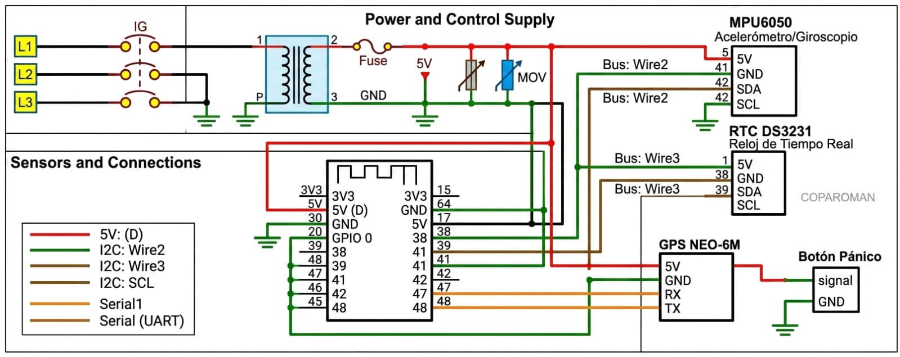

# IoT Implementation for Women's Safety
## Implementación del IoT para la Seguridad de las Mujeres

**Tema 1: Estándares de Comunicación Inalámbrica**


**Repositorio GitHub:** [github.com/Karenperezor/Codigo-Integrador6](https://github.com/Karenperezor/Codigo-Integrador6)  
**Estado:** Repositorio Público — Acceso abierto para replicación del proyecto

---

## Estudiantes

| Nombre | Número de control |
|--------|-------------------|
| **Melanie Santiago Resendiz** | 230110616 |
| **Karen Pérez Ortiz** | 230110326 |
| **Carol Mera Ibarra** | 230110264 |
| **Andrea Jacob Salas** | 230110449 |
| **Freyra Wendy Martínez Martínez** | 230110434 |

**Institución:** Instituto Tecnológico Superior del Occidente del Estado de Hidalgo  
**Grado y Grupo:** 6° "B"  
**Materia:** Tecnologías Inalámbricas — Tema 1: Estándares de Comunicación Inalámbrica

---

## Tabla de Contenidos

- [Introducción](#introducción)
  - [Planteamiento del Problema](#planteamiento-del-problema)
  - [Arquitectura de Comunicación Inalámbrica](#arquitectura-de-comunicación-inalámbrica)
  - [Característica Diferenciadora: Privacidad Centrada en el Consentimiento](#característica-diferenciadora-privacidad-centrada-en-el-consentimiento)
- [Justificación](#justificación)
- [Objetivos](#objetivos)
  - [Objetivo General](#objetivo-general)
  - [Objetivos Específicos](#objetivos-específicos)
- [Requerimientos de Software y Hardware](#requerimientos-de-software-y-hardware)
  - [Hardware](#hardware)
  - [Software](#software)
- [Tabla de Conexiones](#tabla-de-conexiones)
  - [Nodo Emisor (Heltec ESP32 LoRa v3)](#nodo-emisor-heltec-esp32-lora-v3)
  - [Nodo Receptor (Heltec ESP32 LoRa v3)](#nodo-receptor-heltec-esp32-lora-v3)
  - [Gateway LilyGO T-SIM7000 (GPRS)](#gateway-lilygo-t-sim7000-gprs)
  - [Topología de Red](#topología-de-red)
- [Tabla de Direccionamiento](#tabla-de-direccionamiento)
- [Esquema de Funcionamiento](#esquema-de-funcionamiento)
  - [Flujo de Datos Completo](#flujo-de-datos-completo)
  - [Pantallas del Receptor](#pantallas-del-receptor)
  - [Diagrama de Capas OSI](#diagrama-de-capas-osi)
  - [Lógica de Alertas en Node-RED](#lógica-de-alertas-en-node-red)
- [Códigos Comentados del Proyecto](#códigos-comentados-del-proyecto)
  - [Nodo Emisor — Version1-TRANSMISOR.ino](#nodo-emisor--version1-transmisorino)
  - [Nodo Receptor — receptor_Hv2.ino](#nodo-receptor--receptor_hv2ino)
  - [Gateway Celular — lilygo.ino](#gateway-celular--lilygoino)
  - [Flujo Node-RED — node-red.json](#flujo-node-red--node-redjson)
- [Explicación de Configuraciones de Sensores y Tarjetas](#explicación-de-configuraciones-de-sensores-y-tarjetas)
  - [MAX30102 (Sensor Biométrico)](#max30102-sensor-biométrico)
  - [MPU6050 (Acelerómetro de 6 ejes)](#mpu6050-acelerómetro-de-6-ejes)
  - [NEO-6M (Módulo GPS)](#neo-6m-módulo-gps)
  - [DS1307 (Reloj en Tiempo Real)](#ds1307-reloj-en-tiempo-real)
  - [Heltec ESP32 LoRa v3 (Microcontrolador)](#heltec-esp32-lora-v3-microcontrolador)
  - [LilyGO T-SIM7000 (Gateway GPRS)](#lilygo-t-sim7000-gateway-gprs)
- [Explicación de Alimentación Móvil y Fija](#explicación-de-alimentación-móvil-y-fija)
- [Recomendaciones de Mejora y Precauciones de Uso](#recomendaciones-de-mejora-y-precauciones-de-uso)
- [Instalación y Configuración Rápida](#instalación-y-configuración-rápida)
- [Bibliografía](#bibliografía)

---

## Introducción

Este proyecto implementa un **sistema IoT funcional basado en tecnologías inalámbricas de largo alcance y bajo consumo** para el monitoreo en tiempo real de signos vitales y geolocalización de mujeres en situación de vulnerabilidad. El prototipo opera mediante la integración de nodos sensores y gateways que transmiten datos biométricos desde una pulsera emisora inteligente hacia un servidor central de procesamiento y visualización.

[↑ Volver al índice](#tabla-de-contenidos)

### Planteamiento del Problema

El proyecto aborda directamente la problemática de la **violencia de género en el municipio de Tlahuelilpan, Hidalgo**, donde el **70.1% de las mujeres de 15 años o más han experimentado al menos un incidente de violencia** según datos del INEGI. Esta solución se alinea con el **eje de Seguridad Humana de los PRONACES** (Programas Nacionales Estratégicos).

### Arquitectura de Comunicación Inalámbrica

El sistema integra dos categorías de tecnologías inalámbricas:

- **LoRa (LPWAN):** Comunicación de corto a medio alcance entre la pulsera emisora y el gateway receptor.
- **GPRS (WWAN):** Transmisión de datos hacia el servidor en la nube desde el gateway.

Esta combinación garantiza **cobertura robusta en escenarios donde el Wi-Fi es limitado** y proporciona **conectividad sin interrupciones durante emergencias**.

### Característica Diferenciadora: Privacidad Centrada en el Consentimiento

A diferencia de otras soluciones de monitoreo continuo, este prototipo incorpora un **mecanismo de privacidad que activa la transmisión de datos únicamente durante una hora a partir del momento en que la usuaria presiona el botón de pánico**. Esto evita el rastreo permanente de su ubicación, diferenciando al prototipo de sistemas basados en WLAN o satelitales.

---

## Justificación

### ¿Por qué este proyecto es necesario?

1. **Violencia de Género:** La violencia contra las mujeres es un problema crítico en México que requiere soluciones tecnológicas accesibles y confiables.

2. **Tecnología Apropiada:** Las tecnologías inalámbricas como LoRa y GPRS permiten:
   - Monitoreo en tiempo real sin dependencia de Wi-Fi.
   - Operación en zonas con cobertura celular limitada.
   - Bajo consumo energético para dispositivos portátiles.

3. **Beneficiario Directo:** El **Instituto de la Mujer de Tlahuelilpan** requiere herramientas de vanguardia para la protección y seguimiento de sus usuarias con precisión sin precedentes.

4. **Aplicación Educativa:** Este desarrollo fortalece la comprensión práctica de los estándares de comunicación inalámbrica (Temas 1, 2 y 3) mediante un caso de uso real y socialmente relevante.

5. **Escalabilidad:** El diseño modular permite escalar la solución a otras instituciones y municipios con problemáticas similares.

[↑ Volver al índice](#tabla-de-contenidos)

---

## Objetivos

### Objetivo General

Diseñar y construir un **prototipo IoT funcional basado en Heltec ESP32 LoRa v3** que monitoree en tiempo real:
- Ritmo cardíaco (BPM)
- Oxigenación en sangre (SpO2)
- Aceleración en tres ejes (X, Y, Z)
- Ubicación GPS de la usuaria

Transmitiendo los datos vía **LoRa y GPRS** a la Instancia Gubernamental durante una **ventana de una hora activada por una sola pulsación del botón de pánico**, aplicando los estándares de comunicación inalámbrica para garantizar **calidad, confiabilidad y seguridad** de los datos.

### Objetivos Específicos

1. **Implementar la lectura simultánea** de SpO2, BPM y aceleración (ejes X, Y, Z) en la pulsera emisora LoRa, incluyendo activación por doble pulsación del botón de pánico.

2. **Configurar la comunicación LoRa** entre la pulsera emisora y el gateway LilyGO T-SIM, verificando la integridad de la trama en el display de cada módulo.

3. **Establecer el enlace GPRS** con el broker público HiveMQ mediante el APN de Telcel, publicando paquetes JSON con todos los parámetros del sensor.

4. **Desarrollar un dashboard en Node-RED** con mapa GPS en tiempo real, medidores de BPM y SpO2, historial de aceleración y lógica de alertas automáticas.

5. **Estructurar una base de datos en InfluxDB** vinculada a Grafana para el registro histórico de signos vitales, aceleración y geolocalización.

[↑ Volver al índice](#tabla-de-contenidos)

---

## Requerimientos de Software y Hardware

### Hardware

#### Nodo Emisor (Pulsera Inteligente)

| Componente | Modelo | Función |
|-----------|--------|---------|
| **Microcontrolador Principal** | Heltec ESP32 LoRa v3 | Procesamiento central, radio LoRa integrado (SX1262) |
| **Sensor Biométrico** | MAX30102 | Medición de ritmo cardíaco (BPM) y oxigenación (SpO2) |
| **Acelerómetro** | MPU6050 | Detección de movimiento y caídas (ejes X, Y, Z) |
| **Módulo GPS** | NEO-6M | Geolocalización en tiempo real |
| **Reloj en Tiempo Real** | DS1307 | Marca de tiempo independiente de GPS |
| **Batería** | LiPo 3.7V (2000 mAh) | Alimentación del nodo emisor |
| **Carcasa** | Impresión 3D personalizada | Protección de componentes |

#### Nodo Receptor y Gateway

| Componente | Modelo | Función |
|-----------|--------|---------|
| **Receptor LoRa** | Heltec ESP32 LoRa v3 | Recepción de tramas LoRa |
| **Gateway de Datos** | LilyGO T-SIM7000 | Módulo GPRS para conexión celular |
| **Red Celular** | Telcel (2G/3G) | Conectividad WWAN |

#### Servidor Local

| Componente | Especificación | Función |
|-----------|----------------|---------|
| **Computadora** | x86 / ARM | Alojamiento de servicios |
| **SO** | Linux / Windows / macOS | Sistema operativo |

---

### Software

#### En el Nodo Emisor (Arduino IDE con ESP32 Heltec)
```
- RadioLib.h          (SX1262 en Heltec)
- HT_SSD1306Wire      (Display OLED)
- HT_TinyGPS++        (Módulo GPS NEO-6M)
- RTClib              (RTC DS3231)
- MPU6050             (Acelerómetro)
- MAX30105            (Sensor biométrico)
- heartRate           (Algoritmo de detección de pulsaciones)
- HardwareSerial      (UART para GPS)
- Lenguaje: C++ (Arduino Sketch)
```

#### En el Nodo Receptor (Arduino IDE con ESP32)
```
- RadioLib.h          (SX1276 en Heltec)
- Adafruit_SSD1306    (Display OLED)
- Adafruit_GFX        (Librería gráfica)
- esp_now.h           (Comunicación RF)
- WiFi.h              (Inicializar ESP-NOW)
- Lenguaje: C++ (Arduino Sketch)
```

#### En el Gateway (Arduino IDE con LilyGO T-SIM7000)
```
- TinyGsmClient.h     (Módulo GPRS SIM7000)
- PubSubClient.h      (Cliente MQTT)
- WiFi.h              (WiFi + ESP-NOW)
- esp_now.h           (Recibir datos RF)
- HardwareSerial      (UART para módem)
- Lenguaje: C++ (Arduino Sketch)
```

#### En el Servidor Local
```
- Node-RED v3.0.0+    (Flujos de procesamiento)
- InfluxDB v2.0+      (Base de datos de series de tiempo)
- Grafana v9.0+       (Visualización de datos)
- Broker MQTT: HiveMQ (público)
- Docker              (opcional, para contenedores)
```

#### Herramientas de Desarrollo
```
- Arduino IDE 2.0+
- Git & GitHub        (versionamiento)
- Visual Studio Code  (edición de código)
- Postman             (pruebas de API)
```

[↑ Volver al índice](#tabla-de-contenidos)

---

## Tabla de Conexiones

### Nodo Emisor (Heltec ESP32 LoRa v3)



#### Sensor MAX30102 (I2C)

| Pin MAX30102 | Pin Heltec ESP32 |
|-------------|-----------------|
| SDA | GPIO 21 |
| SCL | GPIO 22 |
| VCC | 3.3V |
| GND | GND |


#### Acelerómetro MPU6050 (I2C)

| Pin MPU6050 | Pin Heltec ESP32 |
|------------|-----------------|
| SDA | GPIO 21 |
| SCL | GPIO 22 |
| VCC | 3.3V |
| GND | GND |
| INT | GPIO 15 |


#### Módulo GPS NEO-6M (UART)

| Pin NEO-6M | Pin Heltec ESP32 |
|-----------|-----------------|
| TX | GPIO 16 (RX) |
| RX | GPIO 17 (TX) |
| VCC | 3.3V |
| GND | GND |


#### Reloj DS1307 (I2C)

| Pin DS1307 | Pin Heltec ESP32 |
|-----------|-----------------|
| SDA | GPIO 21 |
| SCL | GPIO 22 |
| VCC | 3.3V |
| GND | GND |
| BAT | Batería CR2032 |


#### Botón de Pánico

| Pin Botón | Pin Heltec ESP32 |
|----------|-----------------|
| Entrada | GPIO 0 |
| GND | GND |


#### Batería LiPo

| Conexión | Puerto Heltec ESP32 |
|---------|---------------------|
| +3.7V | Puerto USB-C (integrado) |
| GND | GND |


---

### Nodo Receptor (Heltec ESP32 LoRa v2)

#### Display OLED SSD1306 (I2C)

| Pin OLED | Pin Heltec ESP32 |
|---------|-----------------|
| SDA | GPIO 4 |
| SCL | GPIO 15 |
| RST | GPIO 16 |
| VCC | 3.3V |
| GND | GND |
| Dirección I2C | 0x3C |

#### Buzzer Activo

| Pin Buzzer | Pin Heltec ESP32 |
|-----------|-----------------|
| Señal (+) | GPIO 13 |
| GND (-) | GND |

#### Batería LiPo

| Conexión | Puerto Heltec ESP32 |
|---------|---------------------|
| +3.2V | Puerto USB-C (integrado) |
| GND | GND |

> **Nota:** El nodo receptor **no** incluye sensores biométricos (MAX30102, MPU6050, GPS NEO-6M ni DS1307).  
> Su función es exclusivamente recibir tramas LoRa de la pulsera, mostrarlas en el display OLED  
> y reenviarlas por ESP-NOW al gateway celular (MAC destino: `80:64:6F:FC:0A:50`).

---

### Gateway LilyGO T-SIM7000 (GPRS)

| Componente | Conexión |
|-----------|---------|
| Nodo Receptor Heltec | UART Serial |
| Antena SIM | Ranura SIM integrada |
| Antena GPRS | Conectada en placa |
| Computadora (servidor) | USB Serial |

---

### Topología de Red

```
Pulsera Inteligente → LoRa 915 MHz → Nodo Receptor → ESP-NOW → Gateway LilyGO → GPRS/MQTT → HiveMQ → Node-RED / Grafana / InfluxDB
```

> **Nota:** El diagrama de topología (`diagrama-IOT.png`) se encuentra en la raíz del repositorio. Puedes consultarlo directamente en [GitHub](https://github.com/Karenperezor/Codigo-Integrador6).

El sistema inicia con una **pulsera inteligente basada en Heltec ESP32 LoRa V3**, la cual integra los siguientes sensores:

- **MAX30102** — Mide BPM y SpO2.
- **MPU6050** — Detecta movimiento y caídas.
- **GPS NEO-6M** — Proporciona ubicación en tiempo real.
- **RTC DS1307** — Registra fecha y hora.
- **Botón de pánico** — Activa alertas de emergencia.

Cuando la usuaria presiona el botón de pánico, los datos son enviados mediante **LoRa 915 MHz** hacia el nodo receptor. Este recibe la información, activa alertas locales mediante buzzer y pantalla OLED, y posteriormente envía los datos a internet usando un **LilyGO T-SIM7000G** con conexión **GPRS**.

La información se publica mediante el protocolo **MQTT** en el broker **HiveMQ**, utilizando el tópico:

```text
instituto/mujer/alertas
```

Finalmente, plataformas como **Node-RED**, **Grafana** e **InfluxDB** permiten visualizar, almacenar y monitorear los datos en tiempo real, además de generar alertas automáticas por WhatsApp durante situaciones de emergencia.

[↑ Volver al índice](#tabla-de-contenidos)

---

## Tabla de Direccionamiento

### Configuración de Redes Inalámbricas

#### Red LoRa (WPAN — Personal Area Network)

| Parámetro | Valor | Descripción |
|-----------|-------|-------------|
| **Estándar** | LoRaWAN / LoRa punto a punto | Protocolo inalámbrico LPWAN |
| **Frecuencia** | 868 MHz (Europa) / 915 MHz (América) | Banda ISM no licenciada |
| **Ancho de Banda** | 125 kHz – 500 kHz | Configurable en firmware |
| **Factor de Expansión (SF)** | 7–12 | SF=7: corto alcance, SF=12: largo alcance |
| **Potencia TX** | +20 dBm máximo | Regulado por normativa local |
| **Rango** | 5–15 km (línea visual) | Depende del SF y la altura |
| **Topología** | Punto a punto | Nodo emisor → Nodo receptor |
| **Identificadores** | No requiere dirección MAC única | Comunicación directa en topología local |

#### Red GPRS (WWAN — Wide Area Network)

| Parámetro | Valor | Descripción |
|-----------|-------|-------------|
| **Estándar** | GSM/GPRS (2G) y UMTS (3G) | Redes celulares públicas |
| **Proveedor** | Telcel México | Operador de telecomunicaciones |
| **APN** | internet.telcel.com | Access Point Name para datos |
| **Protocolo** | TCP/IP sobre GPRS | Comunicación de datos en red celular |
| **Velocidad** | 115200 bps (UART serial) | Configuración del módulo LilyGO |
| **Cobertura** | Nacional (Telcel) | Disponibilidad en México |

#### Red MQTT (Broker HiveMQ)

| Parámetro | Valor | Descripción |
|-----------|-------|-------------|
| **Servidor** | broker.hivemq.com | Broker MQTT público |
| **Puerto** | 1883 | Puerto estándar MQTT (sin TLS) |
| **Protocolo** | MQTT v3.1.1 | Protocolo de publicación/suscripción |
| **Tópico de Publicación** | `instituto/mujer/alertas` | Canal de comunicación |
| **QoS** | 0 | Quality of Service (sin garantía de entrega) |
| **Payload** | JSON | Formato de datos transmitido |

#### Base de Datos InfluxDB (Servidor Local)

| Parámetro | Valor | Descripción |
|-----------|-------|-------------|
| **Ubicación** | Localhost (127.0.0.1) | Servidor local |
| **Puerto** | 8086 | Puerto por defecto de InfluxDB |
| **Base de Datos** | iot_women_safety | Nombre de la base de datos |
| **Medición (Tabla)** | sensor_data | Nombre de la serie de tiempo |
| **Campos (Columnas)** | BPM, SpO2, AccX, AccY, AccZ, Latitud, Longitud | Parámetros almacenados |
| **Tags (índices)** | user_id, device_id, timestamp | Claves de búsqueda |

#### Node-RED (Servidor Local)

| Parámetro | Valor | Descripción |
|-----------|-------|-------------|
| **Ubicación** | Localhost (127.0.0.1) | Servidor local |
| **Puerto HTTP** | 1880 | Interfaz de edición de flujos |
| **Suscripción MQTT** | `instituto/mujer/alertas` | Tópico de entrada |
| **Nodos principales** | MQTT-in, Function, Switch, Dashboard | Componentes activos |

#### Grafana (Servidor Local)

| Parámetro | Valor | Descripción |
|-----------|-------|-------------|
| **Ubicación** | Localhost (127.0.0.1) | Servidor local |
| **Puerto HTTP** | 3000 | Interfaz de visualización |
| **Datasource** | InfluxDB (127.0.0.1:8086) | Fuente de datos |
| **Autenticación** | admin:admin (por defecto) | Credenciales iniciales |

---

## Esquema de Funcionamiento

### Flujo de Datos Completo

```
1. PULSERA (Heltec ESP32 LoRa v3 + Sensores)
   ├── Captura signos vitales (BPM, SpO2)
   ├── Captura aceleración (X, Y, Z)
   ├── Captura GPS + Timestamp RTC
   └── Transmite por LoRa cada 2 segundos en modo pánico

        ↓ LoRa 915 MHz (alcance 5–15 km)

2. RECEPTOR (Heltec ESP32 LoRa v3)
   ├── Recibe trama LoRa y valida integridad
   ├── Muestra en 6 pantallas OLED
   ├── Activa buzzer inteligente (solo en pánico)
   └── Reenvía por ESP-NOW al Gateway

        ↓ ESP-NOW 2.4 GHz (línea recta ~100 m)

3. GATEWAY (LilyGO T-SIM7000)
   ├── Recibe por ESP-NOW
   ├── Abre conexión GPRS (Telcel)
   ├── Publica en HiveMQ MQTT
   └── LED parpadea como confirmación visual

        ↓ GPRS/CAT-M (cobertura nacional Telcel)

4. CLOUD (HiveMQ Broker)
   └── Almacena en tópico: instituto/mujer/alertas
       → Disponible para Node-RED / Grafana
```

### Pantallas del Receptor (6 diferentes)

| # | Nombre | Contenido | Cuándo aparece |
|---|--------|-----------|----------------|
| 1 | **ESPERA** | Arcos de señal LoRa animados + barra de escaneo | Sin datos recibidos |
| 2 | **DATOS / ALERTA** | BPM y aceleración en tarjetas; se invierte si hay pánico | Datos normales o pánico |
| 3 | **DETALLES GPS** | Coordenadas, badge FIX, número de satélites | En cualquier momento |
| 4 | **ESTADÍSTICAS** | 3 tarjetas: RX / ERR / %OK + barra de éxito | En cualquier momento |
| 5 | **HISTORIAL** | Últimos 5 paquetes con alternancia de fondo | En cualquier momento |
| 6 | **SEÑAL PERDIDA** | Ícono de antena rota, tiempo MM:SS, barra de timeout | >15 segundos sin recepción |

### Diagrama de Capas OSI

```
Capa 7 — APLICACIÓN
         Grafana (visualización), API REST de Node-RED

Capa 6 — PRESENTACIÓN
         Formato JSON, gráficas en tiempo real

Capa 5 — SESIÓN
         MQTT (conexión a broker HiveMQ)

Capa 4 — TRANSPORTE
         TCP (MQTT sobre HiveMQ)
         UART Serial (Heltec → LilyGO)

Capa 3 — RED
         GPRS (LilyGO T-SIM) — WAN
         Estructura de paquete MQTT
         Pila TCP/IP

Capa 2 — ENLACE DE DATOS
         I2C (sensores internos al microcontrolador)
         LoRa (modulación SX1262, Heltec emisor → receptor)
         Trama GSM (GPRS sobre Telcel)

Capa 1 — FÍSICA
         LoRa: 915 MHz, modulación LoRa, alcance 5–15 km
         GPRS: 2G/3G Telcel, antena celular
         I2C: 3.3V, 100–400 kHz
         UART: 115200 bps
         GPIO: lógica 3.3V
```

### Lógica de Alertas en Node-RED

```javascript
// Pseudocódigo de la lógica implementada en Node-RED

if (SpO2 < 90) {
    alert_type   = "CRÍTICA";
    alert_reason = "Oxigenación baja";
    severity     = "HIGH";
    action       = "Notificar al Instituto inmediatamente";
}

if (BPM < 50 || BPM > 120) {
    alert_type   = "ADVERTENCIA";
    alert_reason = "Ritmo cardíaco anómalo";
    severity     = "MEDIUM";
}

if (aceleracion_magnitude > 2.0) {   // unidades: g
    alert_type   = "CAÍDA DETECTADA";
    alert_reason = "Cambio abrupto de aceleración";
    severity     = "HIGH";
    action       = "Solicitar confirmación de usuaria o asistencia";
}

// Enviar a Grafana con timestamp
update_dashboard(BPM, SpO2, acceleration, GPS_location, alert_type);
```

[📄 Flujo Node-RED — node-red.json](https://github.com/Karenperezor/Codigo-Integrador6/blob/main/node-red.json)

[↑ Volver al índice](#tabla-de-contenidos)

---

## Códigos Comentados del Proyecto

### 1. Código del Nodo Emisor — PULSERA (Heltec ESP32 LoRa v3)

**Características principales:**
- Detecta automáticamente emergencias (caídas > 3.5g, forcejeo > 2.0g).
- Monitoreo de signos vitales (BPM, SpO2) con MAX30102.
- Geolocalización GPS con marca de tiempo RTC.
- Transmisión LoRa cada 2 segundos durante el modo pánico.
- Pantalla OLED con interfaz visual mejorada.
- Gestión inteligente de múltiples buses I2C.

[📄 Nodo Emisor — Version1-TRANSMISOR.ino](https://github.com/Karenperezor/Codigo-Integrador6/blob/main/Version1-TRANSMISOR.ino)

### 2. Código del Nodo Receptor LoRa (Heltec ESP32 LoRa v3)

**Características principales:**
- Recibe datos LoRa de la pulsera.
- Reenvía por ESP-NOW al gateway celular.
- 6 pantallas OLED con interfaz mejorada.
- Detección automática de pérdida de señal.
- Buzzer inteligente (solo en modo pánico).
- LED indicador de actividad.

[📄 Nodo Receptor — receptor_Hv2.ino](https://github.com/Karenperezor/Codigo-Integrador6/blob/main/receptor_Hv2.ino)

### 3. Código del Gateway GPRS (LilyGO T-SIM7000 + ESP-NOW)

**Características principales:**
- Recibe datos por **ESP-NOW** del receptor LoRa.
- Conecta a la red celular Telcel (GPRS/CAT-M).
- Publica en HiveMQ MQTT sin intermediarios.
- Reconexión automática de GPRS y MQTT.
- LED de confirmación visual.

[📄 Gateway Celular — lilygo.ino](https://github.com/Karenperezor/Codigo-Integrador6/blob/main/lilygo.ino)

### 4. Flujo Node-RED — node-red.json

**Características principales:**
- Suscripción al tópico MQTT `instituto/mujer/alertas` en HiveMQ.
- Parseado de paquetes JSON con BPM, SpO2, aceleración y coordenadas GPS.
- Lógica de alertas automáticas por umbrales (SpO2, BPM, caídas).
- Dashboard con mapa GPS en tiempo real, medidores y gráficas históricas.
- Almacenamiento en InfluxDB y notificaciones automáticas por WhatsApp.

[📄 Flujo Node-RED — node-red.json](https://github.com/Karenperezor/Codigo-Integrador6/blob/main/node-red.json)

[↑ Volver al índice](#tabla-de-contenidos)

---

## Explicación de Configuraciones de Sensores y Tarjetas

### MAX30102 (Sensor Biométrico)

**Función:** Mide ritmo cardíaco (BPM) y saturación de oxígeno (SpO2).

**Especificaciones:**
- Protocolo: I2C (dirección: 0x57)
- Voltaje: 1.8V – 5.5V (se usa 3.3V)
- Corriente: 11 mA típico
- Precisión BPM: ±5 bpm
- Precisión SpO2: ±2%
- Longitudes de onda: Rojo (660 nm) e Infrarrojo (880 nm)

**Configuración en código:**
```cpp
particleSensor.setup(
    25,    // Brillo del LED (0–255)
    2,     // Promedio de muestras
    2,     // Modo: 0=HR, 1=SpO2, 2=Multi-LED (HR+SpO2)
    100,   // Tasa de muestreo
    411,   // Ancho de pulso (µs)
    4096   // Resolución ADC
);
```

**Puntos críticos:**
- Requiere contacto directo con la piel.
- Sensible a luz ambiental (proteger con carcasa oscura).
- Necesita calibración inicial con lecturas conocidas.
- Tiempo de estabilización: 10–20 segundos.

---

### MPU6050 (Acelerómetro de 6 ejes)

**Función:** Mide aceleración en 3 ejes (X, Y, Z) y rotación angular.

**Especificaciones:**
- Protocolo: I2C (dirección: 0x68 o 0x69)
- Voltaje: 3.3V – 5V (se usa 3.3V)
- Corriente: 3.9 mA típico
- Rango de aceleración: ±2g, ±4g, ±8g, ±16g (configurable)
- Rango de giroscopio: 250°/s a 2000°/s
- Resolución: 16 bits

**Configuración en código:**
```cpp
mpu.initialize();
mpu.setFullScaleAccelRange(MPU6050_ACCEL_FS_16);  // ±16g
mpu.setFullScaleGyroRange(MPU6050_GYRO_FS_2000);  // ±2000°/s
mpu.setDLPFMode(MPU6050_DLPF_BW_184);             // Filtro 184 Hz
```

**Detección de caídas:**
```cpp
float magnitude = sqrt(ax*ax + ay*ay + az*az);
if (magnitude > 2.0) {   // Umbral en g
    // CAÍDA DETECTADA
}
```

**Calibración:**
- Colocar el módulo sobre una superficie plana.
- Ejecutar `setAccelOffsets()` con el dispositivo horizontal.
- El acelerómetro debe leer (0, 0, 1g) en reposo.

---

### NEO-6M (Módulo GPS)

**Función:** Proporciona geolocalización con coordenadas GPS.

**Especificaciones:**
- Protocolo: UART serial (9600 bps por defecto)
- Voltaje: 3.3V – 5V (se usa 3.3V)
- Corriente: 45 mA típico
- Precisión: 2.5 metros (típico)
- Tiempo de adquisición:
  - Hot start: ~1 segundo
  - Cold start: ~30 segundos
- Frecuencia de actualización: 1–10 Hz

**Configuración en código:**
```cpp
Serial2.begin(9600, SERIAL_8N1, GPS_RX, GPS_TX);
TinyGPSPlus gps;

void loop() {
    while (Serial2.available() > 0) {
        gps.encode(Serial2.read());
    }

    if (gps.location.isValid()) {
        latitude  = gps.location.lat();
        longitude = gps.location.lng();
    }
}
```

**Tramas NMEA disponibles:**
- `GGA` — Posición global (lat, lon, altitud)
- `GSA` — Dilución de precisión
- `GSV` — Satélites visibles
- `RMC` — Datos mínimos + velocidad

**Mejoras de precisión:**
- Esperar al menos 4 satélites (`gps.satellites.isValid()`).
- Promediar 5–10 lecturas para ubicación crítica.

---

### DS1307 (Reloj en Tiempo Real)

**Función:** Proporciona timestamp independiente, incluso sin señal GPS.

**Especificaciones:**
- Protocolo: I2C (dirección: 0x68)
- Voltaje: 4.5V – 5.5V (se usa 3.3V con resistencias pull-up)
- Batería: CR2032 (3V, interna)
- Precisión: ±2 minutos por mes típico
- Corriente: 500 µA con batería

**Configuración en código:**
```cpp
#include <RTClib.h>

RTC_DS1307 rtc;

void setup() {
    if (!rtc.begin()) {
        Serial.println("RTC no encontrado");
    }
    if (!rtc.isrunning()) {
        // Ajustar a la hora del compilador
        rtc.adjust(DateTime(F(__DATE__), F(__TIME__)));
    }
}

void read_timestamp() {
    DateTime now = rtc.now();
    sprintf(timestamp, "%04d-%02d-%02d %02d:%02d:%02d",
            now.year(), now.month(), now.day(),
            now.hour(), now.minute(), now.second());
}
```

**Ventajas sobre GPS para timestamp:**
- No requiere adquisición satelital.
- Respuesta más rápida.
- Permite timestamping en zonas sin cobertura GPS.

**Limitación:** Requiere sincronización inicial y ajuste periódico.

---

### Heltec ESP32 LoRa v3 (Microcontrolador)

**Función:** Procesamiento central, radio LoRa integrado y pantalla OLED.

**Especificaciones:**
- Procesador: Dual-core Xtensa 32-bit @ 240 MHz
- RAM: 520 KB SRAM
- Flash: 4 MB
- Radio LoRa: SX1262 (integrado)
- Pantalla: OLED 128×64 píxeles
- Puerto USB: Serial para programación
- Pines GPIO: 36 (multipropósito)
- ADC: 12 bits, 18 canales
- I2C: 2 buses disponibles
- UART: 3 puertos seriales

**Configuración de pines LoRa:**
```
NSS  → GPIO 8
MOSI → GPIO 10
MISO → GPIO 9
SCK  → GPIO 11
RST  → GPIO 12
DIO0 → GPIO 13
```

**Ventajas:**
- Radio LoRa nativo (no requiere expansión).
- Display integrado para depuración.
- Cargador de batería USB integrado.
- Diseño de bajo consumo.

---

### LilyGO T-SIM7000 (Gateway GPRS)

**Función:** Módulo GPRS para transmisión de datos a través de red celular.

**Especificaciones:**
- Módulo celular: SIM7000
- Bandas soportadas: 2G/3G GSM/GPRS/UMTS
- Voltaje: 3.7V – 4.2V (batería integrada)
- Corriente: ~50 mA en transmisión
- Antena: Integrada en PCB
- Puertos: ranura nano-SIM, UART, USB

**Configuración APN para Telcel (México):**
```
APN:          internet.telcel.com
Usuario:      telcel
Contraseña:   telcel
Protocolo:    GPRS
Velocidad UART: 115200 bps
```

**Secuencia de conexión:**
```
1. Inicializar puerto serial (115200 bps)
2. Enviar comando AT
3. Configurar APN: AT+SAPBR=3,1,"APN","internet.telcel.com"
4. Activar conexión GPRS: AT+SAPBR=1,1
5. Conectar al servidor TCP/MQTT
```

**Comandos AT útiles:**
```
AT            → Prueba de comunicación
AT+CSQ        → Verificar nivel de señal
AT+COPS?      → Operador actual
AT+CREG?      → Estado de registro en red
AT+CGNSINF    → Información GPS (si disponible)
```

[↑ Volver al índice](#tabla-de-contenidos)

---

## Explicación de Alimentación Móvil y Fija

### Alimentación Móvil (Batería LiPo)

**Batería utilizada:** LiPo 3.7V / 2000 mAh

**Características:**
- Voltaje nominal: 3.7V (cargada: 4.2V)
- Capacidad: 2000 mAh
- Química: Polímero de Litio
- Ciclos de carga: 300–500 típicos
- Conector: JST-PH 2.0 mm (estándar)

**Consumo estimado del sistema:**

| Componente | Estado | Corriente |
|-----------|--------|-----------|
| Heltec ESP32 (CPU activo) | Activo | 80 mA |
| Heltec ESP32 (deep sleep) | Reposo | 10 µA |
| Radio LoRa TX | Transmisión | 100 mA |
| Radio LoRa RX | Recepción | 40 mA |
| MAX30102 | Activo | 11 mA |
| MPU6050 | Activo | 3.9 mA |
| GPS NEO-6M | Activo | 45 mA |
| DS1307 | Activo | 0.5 mA |
| Display OLED | Activo | 15 mA |

**Consumo en modo pánico:**
- Lectura de sensores: ~60 mA
- Transmisión LoRa: ~100 mA
- Promedio durante la ventana de 1 hora: ~70 mA

**Autonomía estimada:**

| Batería | Consumo promedio | Autonomía total |
|---------|-----------------|-----------------|
| 2000 mAh | 70 mA | ~28 horas en transmisión continua |

La ventana de pánico de 1 hora está bien cubierta por la capacidad de la batería.

**Estrategias de ahorro de energía implementadas:**
1. Modo sleep entre lecturas.
2. Reducción de frecuencia de lectura GPS (cada 30 segundos).
3. Apagado de sensores no críticos fuera del modo pánico.
4. Display OLED activo solo en modo pánico.

---

### Alimentación Fija (Servidor Local)

**Equipamiento:** Computadora, router, hub USB.

**Requisitos:**
- Alimentación: 110V AC (México)
- Fuente recomendada: mínimo 500W
- UPS (opcional): para proteger contra cortes de energía.

**Consumo de servicios:**

| Servicio | Memoria | CPU estimado |
|---------|---------|-------------|
| Node-RED | 150–300 MB | 5–15% |
| InfluxDB | 100–200 MB | 10–20% |
| Grafana | 200–400 MB | 3–10% |
| Broker MQTT (local) | 20–50 MB | 1–5% |

**Equipo mínimo recomendado:** Intel i3 / AMD Ryzen 3, 4 GB RAM, SSD 256 GB.

**Instalación recomendada (Linux Ubuntu 20.04+):**
```bash
# Levantar todos los servicios con Docker
docker run -d -p 1883:1883 eclipse-mosquitto
docker run -d -p 8086:8086 influxdb
docker run -d -p 3000:3000 grafana/grafana
docker run -d -p 1880:1880 nodered/node-red
```

---

## Recomendaciones de Mejora y Precauciones de Uso

### Mejoras Técnicas Identificadas

| Área | Limitación Actual | Propuesta de Solución | Impacto |
|-----|------------------|----------------------|---------|
| **Consumo Energético** | Batería de 2000 mAh (~28 h) | Implementar deep sleep, GPS bajo demanda, BLE de respaldo | Extender a 48+ horas |
| **Tamaño del Dispositivo** | Pulsera grande (~80×60 mm) | Rediseñar PCB a 40×40 mm, integrar componentes SMD | Mejor discreción y aceptación |
| **Redundancia** | Una sola ruta (LoRa + GPRS) | Agregar Bluetooth BLE como respaldo | Funcionar sin cobertura celular |
| **Seguridad MQTT** | Broker público sin autenticación | Migrar a broker privado con TLS + tokens | Proteger privacidad de datos |
| **Monitoreo Remoto** | Solo local | Implementar VPN segura para acceso remoto | Operadores monitoreando desde cualquier lugar |
| **Precisión GPS** | 2.5 metros | Implementar correcciones DGPS/RTCM | Ubicación más precisa |
| **Gestión de Alertas** | Manual | Dashboard automático con protocolos de respuesta | Respuesta más rápida |

### Historial de Mejoras Implementadas

| Versión | Cambio | Fecha | Efecto |
|---------|--------|-------|--------|
| v1.0 | Batería original de 1000 mAh | Marzo 2026 | Autonomía ~7 horas |
| v1.1 | Actualización a batería de 2000 mAh | Mayo 2026 | Autonomía ~28 horas |
| v1.2 | Pantallas OLED mejoradas | Mayo 2026 | Mejor visualización sin aumento de consumo |

### Precauciones de Uso

#### Para Usuarias

1. **Mantener la batería cargada:**
   - Cargar la noche anterior a cualquier evento.
   - Indicador visual cuando la carga es baja (<20%).
   - Tiempo de carga completa: ~2 horas.
   - En modo pánico: transmite durante 1 hora máximo.

2. **Contacto con la piel:**
   - El sensor MAX30102 debe estar en contacto directo con la piel.
   - Usar en la muñeca, nunca sobre ropa.
   - Limpiar la zona antes de usar.
   - Evitar movimientos excesivos durante la lectura de signos vitales.

3. **Privacidad:**
   - La información solo se transmite cuando se presiona el botón de pánico o se detecta una emergencia automática.
   - El botón de pánico no es visualmente obvio (diseño discreto).
   - Los datos históricos se almacenan solo 30 días (configurable).
   - La transmisión se detiene automáticamente después de 1 hora.

4. **Situaciones de emergencia:**
   - Probar el dispositivo regularmente (al menos una vez por semana).
   - Verificar cobertura celular Telcel en la zona de operación.
   - Tener contactos de confianza configurados en el Instituto.

#### Para Operadores (Instituto de la Mujer)

1. **Capacitación requerida:**
   - Interpretación de datos biométricos.
   - Diferencias entre tipos de alerta (crítica vs. advertencia).
   - Protocolo de respuesta ante caídas detectadas.

2. **Mantenimiento de infraestructura:**
   - El servidor debe estar activo 24/7.
   - Copias de seguridad diarias de InfluxDB.
   - Revisión periódica de logs de errores (MQTT, Node-RED).

3. **Conformidad legal:**
   - Datos personales almacenados < 30 días.
   - Consentimiento explícito de la usuaria para la transmisión.
   - Registro de accesos a datos.

4. **Escalabilidad:**
   - Por cada 100 usuarias adicionales: +1 GB RAM en el servidor.
   - Considerar replicación de servicios si se supera esta cifra.

#### Para Desarrolladores (Mantenimiento Futuro)

1. **Actualizaciones de firmware:**
   - Usar OTA (Over-The-Air) para ESP32.
   - Probar en banco de pruebas antes de desplegar.
   - Mantener respaldo de la versión anterior.

2. **Monitoreo de sensores:**
   - MAX30102: verificar calibración cada 1000 ciclos.
   - MPU6050: revisar offsets trimestralmente.
   - GPS: verificar almanaque de satélites periódicamente.

3. **Seguridad:**
   - Cambiar contraseñas por defecto de Grafana e InfluxDB.
   - Implementar HTTPS en Node-RED.
   - Auditar acceso al broker MQTT.

4. **Métricas de rendimiento objetivo:**
   - Latencia MQTT: < 3 segundos.
   - Pérdida de paquetes: < 1%.
   - Precisión GPS: < 5 metros.

[↑ Volver al índice](#tabla-de-contenidos)

---

## Instalación y Configuración Rápida

### Instalación del Firmware en Heltec

```bash
# 1. Instalar Arduino IDE 2.0+
# 2. Agregar URL del gestor de placas:
#    https://raw.githubusercontent.com/Heltec-Aaron-Lee/WiFi_Kit_series/master/package_heltec_esp32_index.json
# 3. Instalar "Heltec ESP32" desde el gestor de placas
# 4. Seleccionar: Heltec WiFi LoRa 32 (V3)
# 5. Cargar código: Sketch → Upload
```

### Instalación del Servidor Local (Docker Compose)

```bash
# Crear carpeta de trabajo
mkdir iot_women_safety && cd iot_women_safety

# Crear docker-compose.yml
cat > docker-compose.yml << 'EOF'
version: '3'
services:
  influxdb:
    image: influxdb:2.0
    ports:
      - "8086:8086"
    environment:
      INFLUXDB_DB: iot_women_safety
    volumes:
      - ./data/influxdb:/var/lib/influxdb

  grafana:
    image: grafana/grafana:latest
    ports:
      - "3000:3000"
    depends_on:
      - influxdb
    volumes:
      - ./data/grafana:/var/lib/grafana

  nodered:
    image: nodered/node-red:latest
    ports:
      - "1880:1880"
    volumes:
      - ./data/nodered:/data

  mosquitto:
    image: eclipse-mosquitto
    ports:
      - "1883:1883"
    volumes:
      - ./mosquitto.conf:/mosquitto/config/mosquitto.conf
EOF

# Levantar todos los servicios
docker-compose up -d
```

[↑ Volver al índice](#tabla-de-contenidos)

---

## Bibliografía

[1] S. Monk, *Programming Arduino: Getting Started with Sketches*, 2nd ed. New York, NY: McGraw-Hill Education, 2016.

[2] R. Faludi, *Building Wireless Sensor Networks*, 1st ed. Sebastopol, CA: O'Reilly Media, 2010.

[3] Telcel, "Especificaciones de red y configuración de APN para servicios GPRS en México," 2024. [En línea]. Disponible en: https://www.telcel.com/personas/servicios/telcel-internet/configuracion-internet

[4] HiveMQ, "MQTT Essentials — A Lightweight IoT Protocol," 2023. [En línea]. Disponible en: https://www.hivemq.com/blog/mqtt-essentials/

[5] Grafana Labs, "InfluxDB data source documentation," 2024. [En línea]. Disponible en: https://grafana.com/docs/grafana/latest/datasources/influxdb/

[6] InfluxData, "InfluxDB documentation," 2023. [En línea]. Disponible en: https://docs.influxdata.com/influxdb/

[7] Node-RED, "Node-RED documentation," 2024. [En línea]. Disponible en: https://nodered.org/docs/

[8] Espressif Systems, *ESP32 Technical Reference Manual*, 2023. [En línea]. Disponible en: https://www.espressif.com

[9] Semtech Corporation, "LoRa Modulation Basics," 2022. [En línea]. Disponible en: https://www.semtech.com/lora

[10] Maxim Integrated / Analog Devices, "MAX30102 Pulse Oximeter and Heart-Rate Sensor Datasheet," 2021. [En línea]. Disponible en: https://www.analog.com/media/en/technical-documentation/data-sheets/MAX30102.pdf

[11] InvenSense / TDK, "MPU-6050 Six-Axis Gyro and Accelerometer Datasheet," 2013. [En línea]. Disponible en: https://invensense.tdk.com/wp-content/uploads/2015/02/MPU-6000-Datasheet1.pdf

[12] IEEE, "IEEE 11073-10406: Standard for Personal Health Device Communication — Device Specialization Pulse Oximeter," 2020. [En línea].

[13] LoRa Alliance, "LoRaWAN Specification v1.1," 2020. [En línea]. Disponible en: https://lora-alliance.org/

[14] MQTT.org, "MQTT Version 3.1.1," 2014. [En línea]. Disponible en: https://mqtt.org/mqtt-specification

[↑ Volver al índice](#tabla-de-contenidos)

---

**Proyecto Integrador — Tecnologías Inalámbricas**  
Instituto Tecnológico Superior del Occidente del Estado de Hidalgo • 6° "B" • 2026